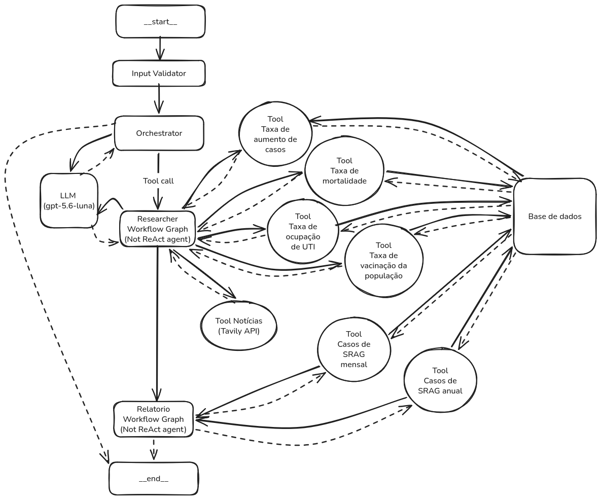

## Agente Langgraph de relatórios sobre Síndrome Respiratória Aguda Grave (SRAG)


### Como executar
Você precisará dos serviços: Tavily by Nebius(Free Tier), Open AI API Key, Langfuse(Free Tier).

- Configure a .env usando a .env.example na raíz do diretório.
- Baixe o dataset de SRAG em [Open DATASUS](https://dadosabertos.saude.gov.br/dataset/srag-2019-a-2026/resource/d96d6348-083a-4184-a39a-794b5e8ec337). Transfira-o para a raíz do diretório.

Com o docker instalado, execute:
```bash
docker build -t api .
docker run -p 8000:8000 api
```

Use a rota POST http://localhost:8000/chat para iniciar o agente, com a mensagem no body da requisição.
### Arquitetura

O grafo do sistema agêntico modelado, está representado a seguir:



### Decisões de projeto

**Importante**: Como as datas de registros contemplam até o dia 12 de dezembro de 2025, então para haver possibilidade de consulta em tempo real, houve uma adaptação em que o usuário consegue obter as métricas e notícias informando uma data de referência.

Como muitas das etapas eram passos bem definidos, somente no orquestrador houve a necessidade de implantar uma LLM, e o que seriam agentes, se transformaram em graph-based workflows.

A observabilidade foi totalmente apoiada no [Langfuse](https://langfuse.com/).

Como o agente não teve liberdade de construir e executar queries, não houve necessidade de tratamento de PII(dados sensíveis).

Apesar dos workflows serem deterministicos, as tools foram construídas com a possibilidade de implementação em agentes ReAct.

### Descrição das Tools e Métricas

O campo DT_NOTIFIC foi utilizado para calcular as porções pela data. As vezes alguma métrica possuia linhas com NaN, então foram removidos esses casos.
O tratamento de dados se fez à nível de tool, e o calculo das metricas descritos na tabela a seguir: 

| Métrica(Tool) | Como foi calculada |
| --- | --- |
| taxa_aumento_casos | Variação percentual dos casos notificados no mês da data informada (do dia 1 até a data) em relação ao mesmo intervalo do mês anterior. |
| taxa_mortalidade | Percentual de casos com evolução para óbito entre os casos notificados até a data informada, considerando apenas os que têm desfecho registrado como óbito por SRAG, através do campo `EVOLUCAO`. |
| taxa_ocupacao_UTI | Percentual de casos internados em UTI entre os casos notificados até a data informada. Mede a proporção de casos em UTI, não a ocupação de leitos. Utiliza o campo `UTI` para o cálculo.|
| taxa_vacinacao_populacao | Percentual de casos com vacina contra `COVID-19` registrada entre os casos notificados até a data informada. Usa o campo `VACINA_COV`. Mede a proporção de vacinação *dentre os casos de SRAG*. |

Demais tools:
| Tool | Descrição |
| --- | --- |
| numero_casos_ultimo_mes | Número de casos diários registrados nos últimos 30 dias. |
| numero_mensal_casos_ultimo_ano | Número mensal de casos registrados durante os últimos 12 meses. |
| pesquisa_web | Utiliza a API da Tavily para pesquisar as notícias de SRAG pela web. |  

### Exemplo de saída

O resultado final é um relatório pdf mostrando comentários e métricas. Você pode vê-lo [aqui](assets/relatorio_srag.pdf)
